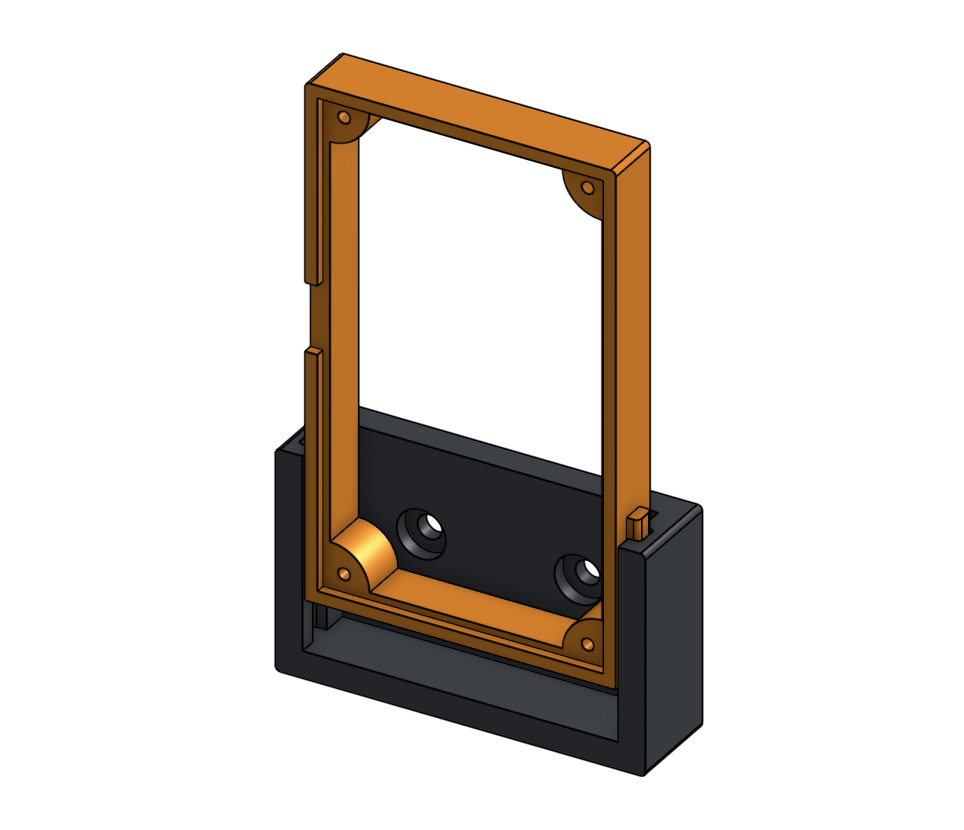
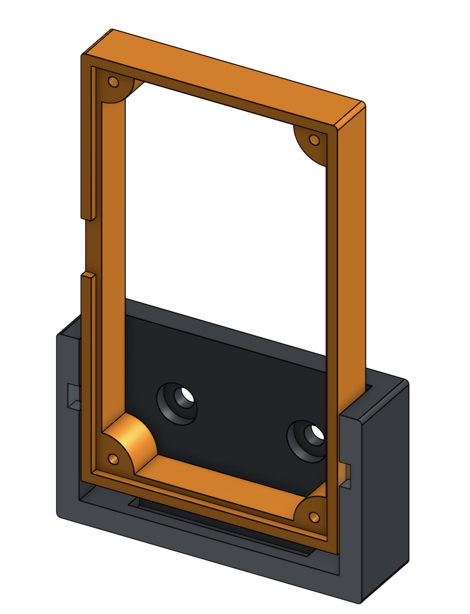

# Bitaxe Wall / Board Mount

Should be compatible with the Max, Ultra, Supra and Gamma.  One has a notch method to take up less space if mounting multiple Bitaxe on top of each other.

| Standard Mount | Notched Mount |
|----------------|---------------|
|  | |

## Links

- [Standard Mount](https://cad.onshape.com/documents/63ed29b19452ae4753b80ebe/w/d2d8c6810b37f1e736c3aa7d/e/0d09dc1eb66c11e7c595b881?renderMode=0&uiState=678581ab81a73468bfb9cf7b)

- [Notched](https://cad.onshape.com/documents/2668aa6e691b414b6fdc49e4/w/c91b9f2708e85eb6e1a58f0b/e/f828397945b3b1c2ae7722fa?renderMode=0&uiState=67858011936d6a0a7e311ca4)
